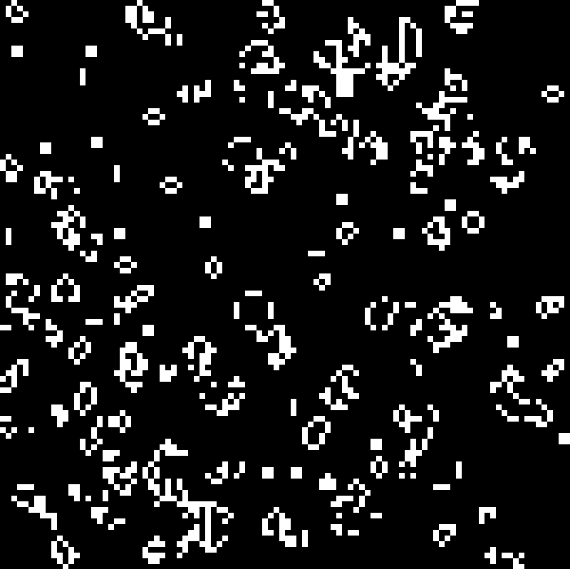

# Conway's Game of Life

A simple implementation of Conway's **Game of Life** using numpy and tkinter.



## Quick Run:
```console
$ python -m gol
```

## Patterns:
Available patterns: Blinker, Toad, Beacon, Ant, LWSS, Pulsar.
See [example.py](https://github.com/amansinclair/gol/blob/master/example.py)

